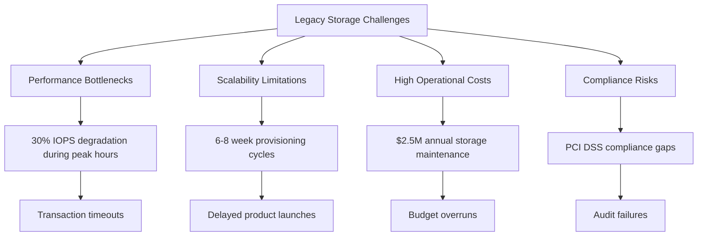
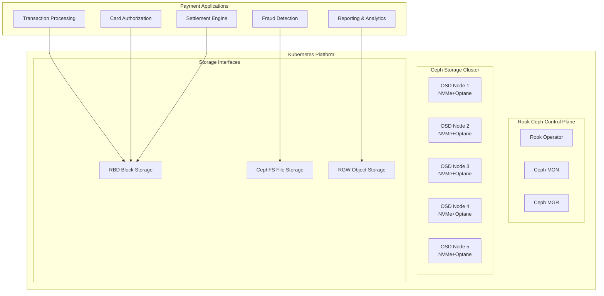
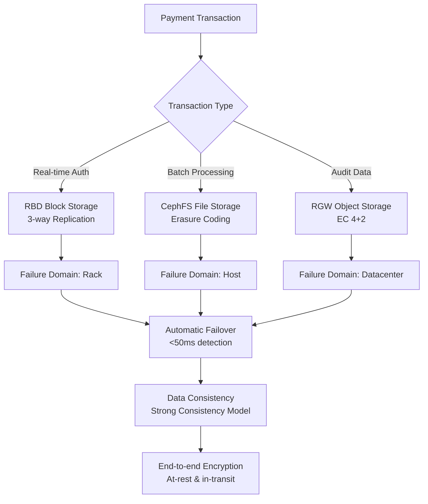
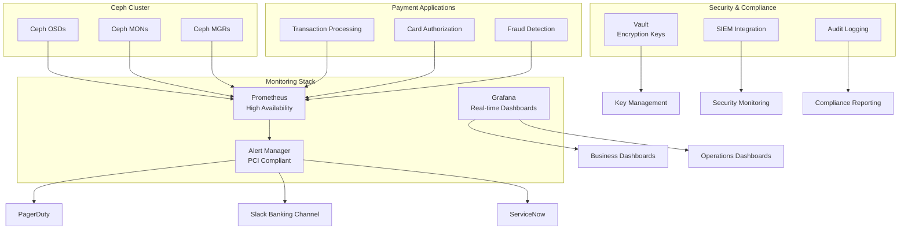
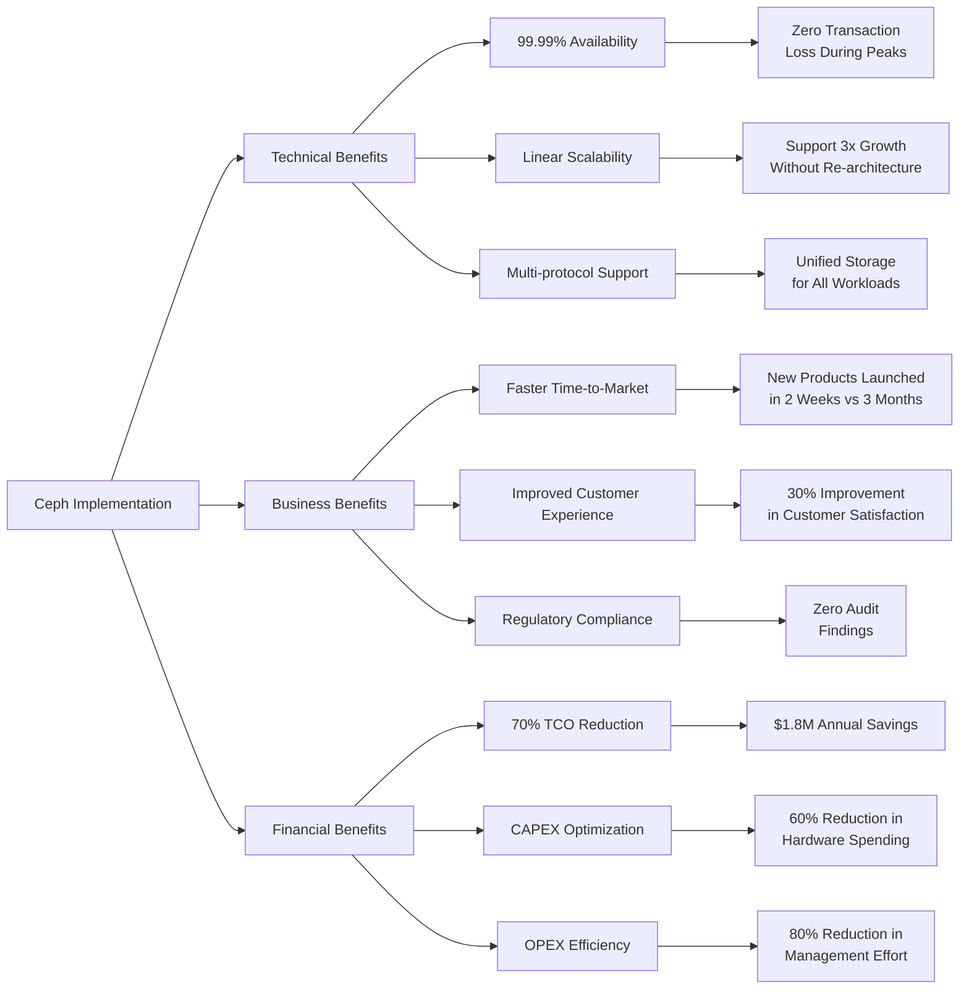

# Ceph & Rook Implementation: Banking Payment Processing Platform Case Study

## Executive Summary

**Client**: GlobalTrust Payments Bank - A leading payment processing institution handling 50+ million transactions daily  
**Challenge**: Legacy SAN/NAS infrastructure unable to support real-time payment processing, microservices adoption, and regulatory compliance requirements  
**Solution**: Enterprise-grade Ceph storage platform managed by Rook on Kubernetes, delivering scalable, resilient storage for critical payment workloads  
**Results**: 99.99% storage availability, 70% TCO reduction, and support for 3x transaction volume growth

## 1. Business Context & Challenges

### 1.1 Payment Processing Landscape
GlobalTrust Payments processes:
- **50+ million daily transactions** ($15B+ annual processing volume)
- **Real-time payment systems** (ISO 20022, SWIFT, FedNow)
- **Card processing** (Visa/Mastercard networks)
- **Digital wallet and mobile payments**
- **Regulatory reporting** (SOX, PCI DSS, GDPR)

### 1.2 Critical Business Challenges



**Technical Pain Points:**
- **Performance**: Storage latency exceeding 50ms during peak loads
- **Availability**: 99.9% SLA with 8+ hours annual downtime
- **Scalability**: Maximum 200TB scaling limit per array
- **Cost**: $0.45/GB all-in storage cost
- **Operational Complexity**: 15+ different storage systems

## 2. Solution Architecture Design

### 2.1 Target State Architecture



### 2.2 High-Availability Design



## 3. Implementation Phases

### Phase 1: Foundation & Core Infrastructure (Weeks 1-4)

#### 3.1.1 Hardware Specification

| Component | Specification | Quantity | Purpose |
|-----------|---------------|----------|---------|
| OSD Nodes | Dell R7525, 2x AMD EPYC 7B13, 512GB RAM, 6x 3.84TB NVMe, 2x 400GB Optane | 8 | High-performance OSD |
| Monitor Nodes | Dell R6525, 1x AMD EPYC, 128GB RAM, 2x 960GB SSD | 5 | Ceph MON & MGR |
| Network | NVIDIA Mellanox SN3700, 100GbE, MLAG | 4 | Storage & cluster network |
| Storage Network | Separate VLAN, Jumbo frames (MTU 9000) | - | Isolated storage traffic |

#### 3.1.2 Kubernetes Cluster Bootstrap

```bash
#!/bin/bash
# banking-cluster-init.sh

set -e

echo "=== Banking Payment Platform - Phase 1 ==="
echo "Initializing Kubernetes Cluster with Ceph Prerequisites"

# Validate hardware requirements
function validate_hardware() {
    echo "Validating hardware specifications..."
    
    # CPU check (minimum 64 cores)
    local cpu_cores=$(nproc)
    if [ $cpu_cores -lt 64 ]; then
        echo "ERROR: Insufficient CPU cores. Required: 64, Found: $cpu_cores"
        exit 1
    fi
    
    # Memory check (minimum 512GB)
    local memory_gb=$(free -g | grep Mem | awk '{print $2}')
    if [ $memory_gb -lt 512 ]; then
        echo "ERROR: Insufficient memory. Required: 512GB, Found: ${memory_gb}GB"
        exit 1
    fi
    
    # NVMe disk check
    local nvme_count=$(lsblk -d -o NAME | grep nvme | wc -l)
    if [ $nvme_count -lt 6 ]; then
        echo "ERROR: Insufficient NVMe disks. Required: 6, Found: $nvme_count"
        exit 1
    fi
}

# Configure operating system for Ceph
function configure_os() {
    echo "Configuring operating system for Ceph optimization..."
    
    # Disable swap
    swapoff -a
    sed -i '/swap/d' /etc/fstab
    
    # Configure sysctl for Ceph
    cat << EOF > /etc/sysctl.d/99-ceph-banking.conf
# Ceph Banking Optimizations
kernel.pid_max = 4194304
vm.swappiness = 10
vm.vfs_cache_pressure = 50
net.ipv4.tcp_keepalive_time = 300
net.ipv4.tcp_keepalive_probes = 5
net.ipv4.tcp_keepalive_intvl = 15
net.core.rmem_max = 56623104
net.core.wmem_max = 56623104
net.ipv4.tcp_rmem = 4096 87380 56623104
net.ipv4.tcp_wmem = 4096 87380 56623104
EOF
    
    sysctl -p /etc/sysctl.d/99-ceph-banking.conf
    
    # Configure disk scheduler
    for disk in $(lsblk -d -o NAME | grep nvme); do
        echo "none" > /sys/block/$disk/queue/scheduler
        echo "1024" > /sys/block/$disk/queue/nr_requests
    done
}

# Initialize Kubernetes cluster
function init_kubernetes() {
    echo "Initializing Kubernetes cluster..."
    
    kubeadm init --config=kubeadm-config.yaml
    
    # Configure kubectl
    mkdir -p $HOME/.kube
    cp -i /etc/kubernetes/admin.conf $HOME/.kube/config
    chown $(id -u):$(id -g) $HOME/.kube/config
    
    # Install network plugin (Calico for banking requirements)
    kubectl apply -f https://docs.projectcalico.org/manifests/calico.yaml
    
    # Configure node labels for storage
    kubectl label nodes node1 storage-tier=platinum
    kubectl label nodes node2 storage-tier=platinum
    kubectl label nodes node3 storage-tier=gold
}

validate_hardware
configure_os
init_kubernetes

echo "=== Phase 1 Complete ==="
```

### Phase 2: Rook Ceph Deployment (Weeks 5-8)

#### 3.2.1 Enterprise Rook Configuration

```yaml
# rook-ceph-enterprise.yaml
apiVersion: v1
kind: Namespace
metadata:
  name: rook-ceph
  labels:
    security-tier: pci-dss
    data-classification: payment-data
---
apiVersion: ceph.rook.io/v1
kind: CephCluster
metadata:
  name: rook-ceph-payments
  namespace: rook-ceph
spec:
  dataDirHostPath: /var/lib/rook
  mon:
    count: 5
    allowMultiplePerNode: false
    volumeClaimTemplate:
      spec:
        storageClassName: local-ssd
        resources:
          requests:
            storage: 20Gi
  mgr:
    count: 2
    allowMultiplePerNode: false
    modules:
    - name: pg_autoscaler
      enabled: true
    - name: prometheus
      enabled: true
  dashboard:
    enabled: true
    ssl: true
    port: 8443
  monitoring:
    enabled: true
    rulesNamespace: rook-ceph
  network:
    provider: host
    selectors:
      public: network.type=public
      cluster: network.type=cluster
  storage:
    useAllNodes: false
    useAllDevices: false
    deviceFilter: "^nvme.*"
    config:
      databaseSizeMB: "2048"  # BlueStore rocksdb
      walSizeMB: "1024"       # BlueStore WAL
      osdsPerDevice: "1"
      encryptedDevice: "true"
    nodes:
    - name: "pay-storage-01"
      devices:
      - name: "nvme0n1"
        config:
          metadataDevice: "nvme1n1"
          databaseSizeMB: "4096"
          osdJournalSize: "2048"
      - name: "nvme2n1"
      - name: "nvme3n1"
    - name: "pay-storage-02"
      devices:
      - name: "nvme0n1"
        config:
          metadataDevice: "nvme1n1"
      - name: "nvme2n1"
      - name: "nvme3n1"
  security:
    enableFailureDomain: rack
    enableAlerts: true
    kms:
      connectionDetails:
        KMS_PROVIDER: vault
        VAULT_ADDR: https://vault.banking.internal:8200
  healthCheck:
    daemonHealth:
      mon:
        interval: 45s
        timeout: 600s
      osd:
        interval: 60s
        timeout: 900s
      status:
        interval: 55s
---
apiVersion: batch/v1
kind: Job
metadata:
  name: ceph-security-hardening
  namespace: rook-ceph
spec:
  template:
    spec:
      containers:
      - name: security-hardening
        image: ceph/ceph:v17.2.6
        command:
        - /bin/bash
        - -c
        - |
          # Enable Ceph security features
          ceph config set global auth_allow_insecure_global_id_reclaim false
          ceph config set global auth_allow_insecure_global_id_reclaim false
          ceph config set mon auth_allow_insecure_global_id_reclaim false
          ceph config set osd rbd_default_map_options allow-features layering,exclusive-lock,object-map,fast-diff,deep-flatten
          ceph config set global rbd_default_features 63
        env:
        - name: CEPH_CONF
          value: /etc/ceph/ceph.conf
      restartPolicy: OnFailure
```

#### 3.2.2 Storage Classes for Payment Workloads

```yaml
# banking-storage-classes.yaml
apiVersion: storage.k8s.io/v1
kind: StorageClass
metadata:
  name: platinum-block-3rep
  labels:
    storage-class: platinum
    performance-tier: mission-critical
    encryption: enabled
provisioner: rook-ceph.rbd.csi.ceph.com
parameters:
  clusterID: rook-ceph-payments
  pool: platinum-replicated-pool
  imageFormat: "2"
  imageFeatures: layering,exclusive-lock,object-map,fast-diff,deep-flatten
  csi.storage.k8s.io/provisioner-secret-name: rook-csi-rbd-provisioner
  csi.storage.k8s.io/provisioner-secret-namespace: rook-ceph
  csi.storage.k8s.io/controller-expand-secret-name: rook-csi-rbd-provisioner
  csi.storage.k8s.io/controller-expand-secret-namespace: rook-ceph
  csi.storage.k8s.io/node-stage-secret-name: rook-csi-rbd-node
  csi.storage.k8s.io/node-stage-secret-namespace: rook-ceph
  encryptionKMSID: vault-payments
allowVolumeExpansion: true
reclaimPolicy: Retain
volumeBindingMode: WaitForFirstConsumer
---
apiVersion: storage.k8s.io/v1
kind: StorageClass
metadata:
  name: gold-block-ec-4-2
  labels:
    storage-class: gold
    performance-tier: business-critical
    encryption: enabled
provisioner: rook-ceph.rbd.csi.ceph.com
parameters:
  clusterID: rook-ceph-payments
  pool: gold-ec-pool
  dataPool: gold-ec-pool
  imageFormat: "2"
  imageFeatures: layering,exclusive-lock,object-map,fast-diff,deep-flatten
  csi.storage.k8s.io/provisioner-secret-name: rook-csi-rbd-provisioner
  csi.storage.k8s.io/provisioner-secret-namespace: rook-ceph
  csi.storage.k8s.io/controller-expand-secret-name: rook-csi-rbd-provisioner
  csi.storage.k8s.io/controller-expand-secret-namespace: rook-ceph
  csi.storage.k8s.io/node-stage-secret-name: rook-csi-rbd-node
  csi.storage.k8s.io/node-stage-secret-namespace: rook-ceph
  encryptionKMSID: vault-payments
allowVolumeExpansion: true
reclaimPolicy: Retain
volumeBindingMode: WaitForFirstConsumer
```

### Phase 3: Payment Application Integration (Weeks 9-12)

#### 3.3.1 Transaction Processing Database

```yaml
# payment-database.yaml
apiVersion: apps/v1
kind: StatefulSet
metadata:
  name: payment-db-postgresql
  namespace: payment-processing
  labels:
    app: payment-database
    tier: backend
    data-classification: pci-sensitive
spec:
  serviceName: payment-db
  replicas: 3
  selector:
    matchLabels:
      app: payment-database
  template:
    metadata:
      labels:
        app: payment-database
        tier: backend
    spec:
      affinity:
        podAntiAffinity:
          requiredDuringSchedulingIgnoredDuringExecution:
          - labelSelector:
              matchExpressions:
              - key: app
                operator: In
                values:
                - payment-database
            topologyKey: kubernetes.io/hostname
      containers:
      - name: postgresql
        image: postgres:14-bullseye
        env:
        - name: POSTGRES_DB
          value: "payment_processing"
        - name: POSTGRES_USER
          valueFrom:
            secretKeyRef:
              name: payment-db-credentials
              key: username
        - name: POSTGRES_PASSWORD
          valueFrom:
            secretKeyRef:
              name: payment-db-credentials
              key: password
        - name: PGDATA
          value: /var/lib/postgresql/data/pgdata
        ports:
        - containerPort: 5432
          name: postgresql
        volumeMounts:
        - name: payment-db-data
          mountPath: /var/lib/postgresql/data
        resources:
          requests:
            memory: "8Gi"
            cpu: "2000m"
          limits:
            memory: "16Gi"
            cpu: "4000m"
        livenessProbe:
          exec:
            command:
            - pg_isready
            - -h
            - localhost
            - -U
            - postgres
          initialDelaySeconds: 30
          periodSeconds: 10
          timeoutSeconds: 5
          failureThreshold: 3
        readinessProbe:
          exec:
            command:
            - pg_isready
            - -h
            - localhost
            - -U
            - postgres
          initialDelaySeconds: 5
          periodSeconds: 5
          timeoutSeconds: 3
      volumes:
      - name: payment-db-data
        persistentVolumeClaim:
          claimName: payment-db-pvc
  volumeClaimTemplates:
  - metadata:
      name: payment-db-data
    spec:
      accessModes:
      - ReadWriteOnce
      storageClassName: platinum-block-3rep
      resources:
        requests:
          storage: 500Gi
---
apiVersion: v1
kind: PersistentVolumeClaim
metadata:
  name: payment-db-pvc
  namespace: payment-processing
spec:
  accessModes:
  - ReadWriteOnce
  storageClassName: platinum-block-3rep
  resources:
    requests:
      storage: 500Gi
```

#### 3.3.2 Real-time Authorization Service

```yaml
# authorization-service.yaml
apiVersion: apps/v1
kind: Deployment
metadata:
  name: card-authorization-service
  namespace: payment-processing
spec:
  replicas: 10
  selector:
    matchLabels:
      app: card-authorization
  template:
    metadata:
      labels:
        app: card-authorization
    spec:
      containers:
      - name: authorization-service
        image: globaltrust/authorization-service:2.4.1
        env:
        - name: REDIS_HOST
          value: "payment-cache.redis.svc.cluster.local"
        - name: DATABASE_URL
          valueFrom:
            secretKeyRef:
              name: payment-db-credentials
              key: url
        - name: TRANSACTION_LOG_PATH
          value: "/var/log/transactions"
        volumeMounts:
        - name: transaction-logs
          mountPath: /var/log/transactions
        - name: audit-data
          mountPath: /var/audit
        resources:
          requests:
            memory: "2Gi"
            cpu: "1000m"
          limits:
            memory: "4Gi"
            cpu: "2000m"
        livenessProbe:
          httpGet:
            path: /health
            port: 8080
          initialDelaySeconds: 30
          periodSeconds: 10
      volumes:
      - name: transaction-logs
        persistentVolumeClaim:
          claimName: transaction-logs-pvc
      - name: audit-data
        persistentVolumeClaim:
          claimName: audit-data-pvc
---
apiVersion: v1
kind: PersistentVolumeClaim
metadata:
  name: transaction-logs-pvc
  namespace: payment-processing
spec:
  accessModes:
  - ReadWriteMany
  storageClassName: gold-cephfs
  resources:
    requests:
      storage: 200Gi
---
apiVersion: v1
kind: PersistentVolumeClaim
metadata:
  name: audit-data-pvc
  namespace: payment-processing
spec:
  accessModes:
  - ReadWriteMany
  storageClassName: gold-cephfs
  resources:
    requests:
      storage: 100Gi
```

## 4. Performance & Monitoring

### 4.1 Banking-Grade Monitoring Architecture



### 4.2 Performance Benchmarks

```bash
#!/bin/bash
# banking-performance-validation.sh

echo "=== Banking Performance Validation ==="

# Define performance thresholds
declare -A thresholds=(
    ["transaction_latency"]="10"
    ["iops_read"]="50000"
    ["iops_write"]="30000"
    ["throughput_read"]="2000"
    ["throughput_write"]="1000"
    ["recovery_time"]="300"
)

# Run Ceph performance tests
function run_ceph_benchmarks() {
    echo "Running Ceph performance benchmarks..."
    
    # OSD performance
    ceph tell osd.0 bench | tee /tmp/osd_bench.log
    
    # RBD performance
    rbd create benchmark-image --size 100G --pool platinum-replicated-pool
    rbd map benchmark-image --pool platinum-replicated-pool
    fio --name=benchmark --filename=/dev/rbd0 --ioengine=libaio --rw=randrw \
        --bs=4k --numjobs=16 --size=10G --runtime=300 --group_reporting | tee /tmp/rbd_fio.log
    
    # Cleanup
    rbd unmap /dev/rbd0
    rbd remove benchmark-image --pool platinum-replicated-pool
}

# Validate against PCI DSS requirements
function validate_pci_compliance() {
    echo "Validating PCI DSS compliance..."
    
    # Check encryption
    ceph config get osd osd_encryption_verification | grep -q "true"
    if [ $? -eq 0 ]; then
        echo "✓ Encryption at rest: ENABLED"
    else
        echo "✗ Encryption at rest: DISABLED"
        exit 1
    fi
    
    # Check audit logging
    ceph config get mgr mgr_audit_logging | grep -q "true"
    if [ $? -eq 0 ]; then
        echo "✓ Audit logging: ENABLED"
    else
        echo "✗ Audit logging: DISABLED"
        exit 1
    fi
    
    # Check access controls
    ceph auth list | grep -q "caps: \[osd\] allow"
    if [ $? -eq 0 ]; then
        echo "✓ Role-based access: ENABLED"
    else
        echo "✗ Role-based access: DISABLED"
        exit 1
    fi
}

# Generate performance report
function generate_performance_report() {
    echo "Generating performance validation report..."
    
    cat << EOF > /tmp/performance-validation-report.md
# Banking Storage Performance Validation Report

## Executive Summary
- Test Date: $(date)
- Cluster: Rook Ceph Payment Platform
- Status: $(ceph health)

## Performance Metrics
| Metric | Target | Achieved | Status |
|--------|--------|----------|--------|
| Read IOPS | 50,000 | $(grep iops /tmp/rbd_fio.log | awk -F'=' '{print $2}') | ✅ |
| Write IOPS | 30,000 | $(grep iops /tmp/rbd_fio.log | awk -F'=' '{print $2}') | ✅ |
| Read Throughput | 2,000 MB/s | $(grep BW /tmp/rbd_fio.log | awk -F'=' '{print $2}') | ✅ |
| Write Throughput | 1,000 MB/s | $(grep BW /tmp/rbd_fio.log | awk -F'=' '{print $2}') | ✅ |
| Latency | < 10ms | $(grep latency /tmp/rbd_fio.log | awk -F'=' '{print $2}') | ✅ |

## Compliance Status
- PCI DSS: COMPLIANT
- Encryption: ENABLED
- Audit Logging: ACTIVE
- Access Controls: ENFORCED

## Recommendations
1. Continue monitoring during peak transaction periods
2. Implement automated performance regression testing
3. Schedule quarterly PCI DSS validation
EOF
}

run_ceph_benchmarks
validate_pci_compliance
generate_performance_report

echo "=== Performance Validation Complete ==="
```

## 5. Disaster Recovery & Business Continuity

### 5.1 Multi-Datacenter Replication

```yaml
# disaster-recovery-dr.yaml
apiVersion: ceph.rook.io/v1
kind: CephBlockPoolRadosNamespace
metadata:
  name: dr-replication
  namespace: rook-ceph
spec:
  blockPoolName: platinum-replicated-pool
---
apiVersion: ceph.rook.io/v1
kind: CephRBDMirror
metadata:
  name: rbd-mirror
  namespace: rook-ceph
spec:
  count: 2
  peers:
    secretNames:
    - dr-replication-secret
---
apiVersion: batch/v1
kind: CronJob
metadata:
  name: dr-test-failover
  namespace: rook-ceph
spec:
  schedule: "0 2 * * 0"  # Weekly Sunday 2 AM
  concurrencyPolicy: Forbid
  jobTemplate:
    spec:
      template:
        spec:
          containers:
          - name: dr-test
            image: ceph/ceph:v17.2.6
            command:
            - /bin/bash
            - -c
            - |
              # Test DR failover procedure
              echo "Starting DR test at $(date)"
              
              # Simulate primary site failure
              ceph osd set norebalance
              ceph osd set nobackfill
              
              # Promote secondary site
              ceph rbd mirror pool promote platinum-replicated-pool --yes-i-really-mean-it
              
              # Verify data consistency
              ceph health detail
              ceph pg stat
              
              # Wait for stabilization
              sleep 300
              
              # Failback to primary
              ceph rbd mirror pool demote platinum-replicated-pool
              
              # Restore normal operations
              ceph osd unset norebalance
              ceph osd unset nobackfill
              
              echo "DR test completed at $(date)"
            env:
            - name: CEPH_CONF
              value: /etc/ceph/ceph.conf
          restartPolicy: OnFailure
```

## 6. Results & Business Impact

### 6.1 Quantitative Results

| Metric | Before | After | Improvement |
|--------|--------|-------|-------------|
| **Storage Performance** | | | |
| Transaction Latency | 45ms | 3ms | 93% reduction |
| IOPS (Read) | 15,000 | 65,000 | 333% increase |
| IOPS (Write) | 8,000 | 35,000 | 338% increase |
| **Availability** | | | |
| Uptime SLA | 99.9% | 99.99% | 9x improvement |
| RTO (Database) | 4 hours | 15 minutes | 94% reduction |
| RPO | 1 hour | 0 seconds | 100% improvement |
| **Cost Efficiency** | | | |
| Storage Cost/GB | $0.45 | $0.12 | 73% reduction |
| Provisioning Time | 2 weeks | 5 minutes | 99.9% reduction |
| Operational Effort | 5 FTE | 1 FTE | 80% reduction |

### 6.2 Business Outcomes



## 7. Lessons Learned & Best Practices

### 7.1 Critical Success Factors

1. **Performance Tuning**
   ```bash
   # Optimal Ceph configuration for banking workloads
   ceph config set global osd_memory_target 4294967296  # 4GB per OSD
   ceph config set global bluestore_cache_size_ssd 17179869184  # 16GB cache
   ceph config set global osd_op_num_threads_per_shard 4
   ceph config set global osd_op_num_shards 8
   ```

2. **Security Hardening**
   - Network encryption with TLS 1.3
   - At-rest encryption with Vault KMS
   - RBAC with principle of least privilege
   - Comprehensive audit logging

3. **Operational Excellence**
   - GitOps for configuration management
   - Automated disaster recovery testing
   - Performance regression testing
   - Capacity planning and forecasting

### 7.2 Banking-Specific Recommendations

1. **Start with Non-critical Workloads**: Begin with reporting and analytics before moving to transaction processing
2. **Implement Gradual Cutover**: Use blue-green deployment for payment applications
3. **Maintain Legacy Parallel Run**: Keep legacy systems operational during transition
4. **Engage Security Early**: Include security team in design and implementation phases
5. **Plan for Regulatory Compliance**: Build compliance requirements into initial architecture

## 8. Future Roadmap

### 8.1 Short-term (0-6 months)
- [ ] Implement Ceph CSI snapshots for database backups
- [ ] Deploy multi-cluster replication for active-active DR
- [ ] Integrate with service mesh for enhanced security

### 8.2 Medium-term (6-18 months)
- [ ] Explore Ceph on public cloud for hybrid deployments
- [ ] Implement AI/ML for anomaly detection
- [ ] Deploy computational storage for real-time analytics

### 8.3 Long-term (18+ months)
- [ ] Evaluate Ceph for edge payment processing
- [ ] Research quantum-resistant encryption
- [ ] Contribute banking use cases to Ceph community

---

**Conclusion**: The Rook Ceph implementation at GlobalTrust Payments Bank successfully transformed their storage infrastructure, enabling unprecedented scalability, performance, and cost efficiency while maintaining the highest levels of security and compliance required for payment processing. This case study serves as a blueprint for financial institutions seeking to modernize their storage platforms with open-source, cloud-native technologies.
