You're absolutely right! Let me provide the complete architecture with ALL diagrams included.

---

# 🏦 **Global Bank Azure Transformation: Complete Architecture with Diagrams**
*Zero Trust | Multi-Region | Regulatory Compliant | Enterprise Scale*

---

## 🎯 **PHASE 1: BUSINESS TRANSFORMATION FRAMEWORK**

### **1.1 Current State Assessment - COMPLETE WORKFLOW**


**Implementation Steps:**
1. **Business Process Discovery** - Workshop with stakeholders
2. **Technical Inventory** - Deploy Azure Migrate for assessment
3. **Regulatory Gap Analysis** - Map controls to technical requirements
4. **Cost Analysis** - Quantify current spending and optimization opportunities

---

## 🏗️ **PHASE 2: AZURE LANDING ZONE - COMPLETE ARCHITECTURE**

### **2.1 Management Group Hierarchy - FULL DESIGN**

```mermaid
graph TD
    A[🏢 Tenant Root Group] --> B[🔧 Platform Scaling Unit]
    A --> C[📋 Corporate Policies]
    A --> D[🗑️ Decommissioned Resources]
    A --> E[🧪 Sandbox]
    
    B --> F[🌐 Connectivity Subscription]
    B --> G[🔐 Identity Subscription]
    B --> H[📊 Management Subscription]
    B --> I[🛡️ Security Subscription]
    
    C --> J[🇩🇪 FinTrust AG Germany]
    C --> K[🇸🇬 FinTrust Asia Pte Ltd]
    C --> L[🇦🇪 FinTrust ME LLC]
    C --> M[🇺🇸 FinTrust NA Inc]
    
    J --> N[🏭 Production Environment]
    J --> O[💻 Development Environment]
    J --> P[🧪 Testing Environment]
    
    N --> Q[💳 Payments Business Unit]
    N --> R[🏦 Retail Banking BU]
    N --> S[📈 Wealth Management BU]
    
    Q --> T[🔧 Payments Core Subscription]
    Q --> U[💳 Cards Processing Subscription]
    Q --> V[🚨 Fraud Detection Subscription]
    
    T --> W[📱 Application Tier]
    T --> X[🗄️ Data Tier]
    T --> Y[🔗 Integration Tier]
    
    style A fill:#2e7d32,color:white
    style C fill:#1565c0,color:white
    style J fill:#d32f2f,color:white
    style K fill:#f57c00,color:white
    style L fill:#388e3c,color:white
    style M fill:#7b1fa2,color:white
```

**Implementation Code:**
```bicep
resource rootMG 'Microsoft.Management/managementGroups@2021-04-01' = {
  name: 'fintrust-root'
  properties: {
    displayName: 'FinTrust Global'
    details: { parent: { id: '/providers/Microsoft.Management/managementGroups/tenant' } }
  }
}
```

### **2.2 Network Architecture - HUB & SPOKE DESIGN**

```mermaid
graph TB
    subgraph "Germany West Central"
        subgraph "Hub VNet - 10.0.0.0/22"
            A[🛡️ Azure Firewall Premium]
            B[🔒 Azure Bastion]
            C[🌐 Private DNS Resolver]
            D[📊 Network Watcher]
        end
        
        subgraph "Spoke 1: Payments - 10.0.4.0/23"
            E[⚙️ AKS Cluster - Payments API]
            F[🗄️ SQL MI - Transactions]
            G[🔗 Service Bus - Events]
        end
        
        subgraph "Grok: Retail - 10.0.6.0/23"
            H[⚙️ AKS Cluster - Retail Apps]
            I[🗄️ Cosmos DB - Customer Data]
            J[🔌 API Management]
        end
    end
    
    A --> E
    A --> H
    B --> E
    B --> H
    C --> E
    C --> H
    
    style A fill:#d32f2f,color:white
    style E fill:#1976d2,color:white
    style H fill:#388e3c,color:white
```

**Implementation Code:**
```bicep
resource hubVNet 'Microsoft.Network/virtualNetworks@2023-02-01' = {
  name: 'vnet-hub-${location}'
  location: location
  properties: {
    addressSpace: { addressPrefixes: ['10.0.0.0/22'] }
    subnets: [
      { name: 'AzureFirewallSubnet', properties: { addressPrefix: '10.0.0.0/26' } }
      { name: 'GatewaySubnet', properties: { addressPrefix: '10.0.0.64/26' } }
    ]
  }
}
```

---

## 🔐 **PHASE 3: ZERO TRUST SECURITY ARCHITECTURE**

### **3.1 Identity & Access Management - COMPLETE WORKFLOW**

```mermaid
graph TB
    A[👤 User Access Request] --> B[🔍 Conditional Access Evaluation]
    B --> C{📊 Risk Assessment}
    
    C -->|🟢 Low Risk| D[✅ Grant Access with MFA]
    C -->|🟡 Medium Risk| E[🛡️ Step-up Authentication]
    C -->|🔴 High Risk| F[🚫 Block Access + Alert SOC]
    
    D --> G[🎯 Privileged Identity Management]
    E --> G
    F --> H[📞 Security Incident Creation]
    
    G --> I[⏰ Time-bound Access]
    I --> J{🔐 Approval Required?}
    
    J -->|✅ Yes| K[👥 Manager Approval]
    J -->|❌ No| L[⚡ Immediate Access]
    
    K --> M[✅ Approved Access]
    L --> M
    
    M --> N[📱 Application Access]
    M --> O[🖥️ Administrative Access]
    M --> P[🔗 API Access]
    
    style A fill:#1565c0,color:white
    style B fill:#ff9800,color:white
    style C fill:#f44336,color:white
    style M fill:#388e3c,color:white
```

**Implementation Steps:**
1. **Configure Azure AD Identity Protection**
2. **Create Conditional Access Policies**
3. **Implement Privileged Identity Management**
4. **Set up Access Reviews**

### **3.2 Data Protection & Encryption Architecture**

```mermaid
graph TB
    A[🔐 Data Protection Framework] --> B[🗂️ Data Classification]
    A --> C[🔒 Encryption Strategy]
    A --> D[👁️‍🗨️ Data Loss Prevention]
    
    B --> E[🔴 Tier 1: Sovereign Data]
    B --> F[🟡 Tier 2: Confidential Data]
    B --> G[🟢 Tier 3: Internal Data]
    B --> H[🔵 Tier 4: Public Data]
    
    C --> I[💾 Encryption at Rest]
    C --> J[🌐 Encryption in Transit]
    C --> K[🔑 Key Management]
    
    I --> L[Azure SQL TDE + CMK]
    I --> M[Storage Service Encryption]
    I --> N[Azure Disk Encryption]
    
    J --> O[TLS 1.2+ Enforcement]
    J --> P[Certificate Management]
    
    K --> Q[Azure Key Vault HSM]
    K --> R[Key Rotation Policies]
    K --> S[Access Policies]
    
    D --> T[DLP Policies]
    D --> U[Sensitive Data Detection]
    D --> V[Data Exfiltration Prevention]
    
    style A fill:#1565c0,color:white
    style B fill:#d32f2f,color:white
    style C fill:#388e3c,color:white
    style D fill:#7b1fa2,color:white
```

**Implementation Code:**
```bicep
resource keyVault 'Microsoft.KeyVault/vaults@2023-02-01' = {
  name: 'kv-${location}-001'
  location: location
  properties: {
    sku: { name: 'premium', family: 'A' }
    tenantId: subscription().tenantId
    enableRbacAuthorization: true
    enabledForDeployment: true
    enabledForDiskEncryption: true
    enabledForTemplateDeployment: true
  }
}
```

---

## 🗄️ **PHASE 4: DATA PLATFORM ARCHITECTURE**

### **4.1 Data Classification & Flow Architecture**

```mermaid
graph TB
    A[📥 Data Ingestion] --> B{🔍 Azure Purview Classification}
    
    B -->|🔴 PII/KYC Data| C[Tier 1: Sovereign Storage]
    B -->|🟡 Financial Transactions| D[Tier 2: Regional Storage]
    B -->|🟢 Analytics Data| E[Tier 3: Processing Zone]
    B -->|🔵 Public Data| F[Tier 4: Global Distribution]
    
    C --> G[🔒 SQL MI - CMK + TDE + HSM]
    D --> H[🔒 Azure SQL - CMK + TDE]
    E --> I[🔐 Synapse - Column Encryption]
    F --> J[🔑 Storage - SSE]
    
    G --> K[📍 Single Region Residency]
    H --> L[📍 Paired Region DR]
    I --> M[⚙️ Regional Processing Only]
    J --> N[🌍 Global Distribution]
    
    K --> O[📋 GDPR Compliance]
    L --> P[📊 SOX Compliance]
    M --> Q[🌏 MAS-TRM Compliance]
    N --> R[💳 PCI-DSS Compliance]
    
    style A fill:#1565c0,color:white
    style B fill:#ff9800,color:white
    style C fill:#d32f2f,color:white
    style D fill:#f57c00,color:white
    style E fill:#1976d2,color:white
    style F fill:#388e3c,color:white
```

**Implementation Steps:**
1. **Deploy Azure Purview** for data governance
2. **Configure classification rules** for sensitive data
3. **Implement SQL Managed Instance** with advanced security
4. **Set up data retention policies**

### **4.2 SQL Managed Instance Security Architecture**

```mermaid
graph TB
    A[🗄️ SQL Managed Instance] --> B[🔒 Network Security]
    A --> C[🔐 Data Encryption]
    A --> D[👁️‍🗨️ Auditing & Monitoring]
    A --> E[🔑 Access Controls]
    
    B --> F[Private Endpoints]
    B --> G[Network Security Groups]
    B --> H[Minimal TLS 1.2]
    
    C --> I[Transparent Data Encryption]
    C --> J[Always Encrypted]
    C --> K[Column-level Encryption]
    C --> L[Customer Managed Keys]
    
    D --> M[SQL Audit Logs]
    D --> N[Threat Detection]
    D --> O[Vulnerability Assessment]
    
    E --> P[Azure AD Authentication]
    E --> Q[Row-Level Security]
    E --> R[Dynamic Data Masking]
    E --> S[Role-Based Access Control]
    
    F --> T[Log Analytics]
    F --> U[Azure Sentinel]
    F --> V[Security Center]
    
    style A fill:#1565c0,color:white
    style B fill:#d32f2f,color:white
    style C fill:#388e3c,color:white
    style D fill:#7b1fa2,color:white
    style E fill:#f57c00,color:white
```

**Implementation Code:**
```bicep
resource sqlMI 'Microsoft.Sql/managedInstances@2023-02-01-preview' = {
  name: 'sql-mi-${location}'
  location: location
  sku: {
    name: 'GP_Gen5'
    tier: 'GeneralPurpose'
    capacity: 8
  }
  properties: {
    administratorLogin: 'fintrustadmin'
    subnetId: subnet.id
    vCores: 8
    storageSizeInGB: 1024
    minimalTlsVersion: '1.2'
    publicDataEndpointEnabled: false
  }
}
```

---

## 🚀 **PHASE 5: APPLICATION PLATFORM ARCHITECTURE**

### **5.1 Azure Kubernetes Service (AKS) Architecture**

```mermaid
graph TB
    subgraph "AKS Cluster - Payments Production"
        A[🎯 Control Plane] --> B[📊 System Node Pool]
        
        subgraph "User Node Pool 1: Payments API"
            C[📱 Payment Processing Pods]
            D[🚨 Fraud Detection Pods]
            E[🔐 Transaction Auth Pods]
        end
        
        subgraph "User Node Pool 2: Customer API"
            F[👤 Customer Profile Pods]
            G[🏦 Account Management Pods]
            H[📋 KYC Validation Pods]
        end
        
        subgraph "Infrastructure Services"
            I[🔗 Azure CNI Networking]
            J[🛡️ Calico Network Policies]
            K[💾 Azure Disk CSI]
            L[🔑 Azure Key Vault CSI]
        end
        
        I --> M[🔒 Pod Network Security]
        J --> N[🚫 Default Deny All]
        K --> O[📂 Persistent Volumes]
        L --> P[🗝️ Secret Injection]
    end
    
    subgraph "Monitoring & Security"
        Q[📊 Container Insights]
        R[🛡️ Azure Policy for Kubernetes]
        S[🔍 Azure Defender]
        T[📋 Azure Monitor]
    end
    
    C --> Q
    F --> Q
    M --> R
    N --> S
    
    style A fill:#1565c0,color:white
    style B fill:#1976d2,color:white
    style C fill:#d32f2f,color:white
    style F fill:#388e3c,color:white
    style I fill:#7b1fa2,color:white
```

**Implementation Code:**
```bicep
resource aksCluster 'Microsoft.ContainerService/managedClusters@2023-02-01' = {
  name: 'aks-${location}-001'
  location: location
  identity: {
    type: 'UserAssigned'
    userAssignedIdentities: {
      '${managedIdentity.id}': {}
    }
  }
  properties: {
    kubernetesVersion: '1.25.6'
    dnsPrefix: 'aks-${location}'
    networkProfile: {
      networkPlugin: 'azure'
      networkPolicy: 'calico'
      serviceCidr: '10.2.0.0/16'
      dnsServiceIP: '10.2.0.10'
    }
    agentPoolProfiles: [
      {
        name: 'systempool'
        count: 3
        vmSize: 'Standard_D4s_v3'
        osType: 'Linux'
        mode: 'System'
      }
      {
        name: 'userpool1'
        count: 5
        vmSize: 'Standard_D8s_v3'
        osType: 'Linux'
        mode: 'User'
      }
    ]
  }
}
```

### **5.2 Application Deployment Pipeline**

```mermaid
graph TB
    A[👨‍💻 Developer Commit] --> B[🔄 Git Repository]
    B --> C[⚙️ Azure DevOps Pipeline]
    
    C --> D{🔍 Security Scan}
    D -->|✅ Pass| E[🧪 Automated Testing]
    D -->|❌ Fail| F[🚫 Block Deployment]
    
    E --> G[📦 Container Registry]
    G --> H[🎯 AKS Deployment]
    
    H --> I{🔐 Environment}
    I -->|🟢 Development| J[🧪 Dev AKS Cluster]
    I -->|🟡 Testing| K[🔍 Test AKS Cluster]
    I -->|🟠 Staging| L[📋 Staging AKS Cluster]
    I -->|🔴 Production| M[🏭 Prod AKS Cluster]
    
    J --> N[✅ Auto-deploy]
    K --> O[✅ Auto-deploy]
    L --> P[👥 Manual Approval]
    M --> P
    
    P --> Q[📊 Health Checks]
    Q --> R[🎉 Deployment Complete]
    
    style A fill:#1565c0,color:white
    style C fill:#1976d2,color:white
    style P fill:#f57c00,color:white
    style R fill:#388e3c,color:white
```

---

## 📊 **PHASE 6: MONITORING & COMPLIANCE ARCHITECTURE**

### **6.1 Comprehensive Monitoring Architecture**

```mermaid
graph TB
    A[📱 Applications] --> B[📊 Azure Monitor]
    C[⚙️ Infrastructure] --> B
    D[🔐 Security Events] --> B
    E[🗄️ Databases] --> B
    F[🌐 Network] --> B
    
    B --> G[📈 Metrics Collection]
    B --> H[📝 Logs Collection]
    
    G --> I[🔍 Log Analytics Workspace]
    H --> I
    
    I --> J[🚨 Azure Sentinel]
    I --> K[📋 Azure Dashboard]
    I --> L[📊 Power BI Reports]
    
    J --> M[🛡️ Security Incidents]
    J --> N[📋 Threat Detection]
    J --> O[🔧 Automated Response]
    
    K --> P[📱 Real-time Monitoring]
    K --> Q[📈 Performance Analytics]
    K --> R[🔍 Troubleshooting]
    
    L --> S[📋 Compliance Reports]
    L --> T[💰 Cost Analytics]
    L --> U[🎯 Business Metrics]
    
    M --> V[👥 SOC Team Alerts]
    N --> V
    O --> W[⚡ Auto-remediation]
    
    style A fill:#1976d2,color:white
    style C fill:#388e3c,color:white
    style D fill:#d32f2f,color:white
    style J fill:#ff9800,color:white
    style L fill:#7b1fa2,color:white
```

**Implementation Code:**
```bicep
resource logAnalytics 'Microsoft.OperationalInsights/workspaces@2022-10-01' = {
  name: 'law-${location}-001'
  location: location
  properties: {
    sku: { name: 'PerGB2018' }
    retentionInDays: 365
  }
}

resource sentinel 'Microsoft.SecurityInsights/onboardingStates@2023-02-01' = {
  name: 'default'
  properties: {
    customerManagedKey: false
  }
}
```

### **6.2 Compliance Monitoring Dashboard**

```mermaid
graph TB
    A[📋 Compliance Dashboard] --> B[🇪🇺 GDPR Compliance]
    A --> C[🇺🇸 SOX Compliance]
    A --> D[🇸🇬 MAS-TRM Compliance]
    A --> E[💳 PCI-DSS Compliance]
    
    B --> F[🔒 Data Protection Score: 98%]
    B --> G[📊 Privacy Controls: 45/46]
    B --> H[🚨 Open Issues: 2]
    
    C --> I[📈 Financial Controls: 100%]
    C --> J[🔐 Access Reviews: 12/12]
    C --> K[📋 Audit Ready: Yes]
    
    D --> L[🛡️ Security Controls: 95%]
    D --> M[🔍 Risk Assessments: 4/4]
    D --> N[⚡ Incident Response: Ready]
    
    E --> O[💳 Cardholder Data: 100%]
    E --> P[🌐 Network Security: 98%]
    E --> Q[📊 Monitoring: 100%]
    
    F --> R[✅ Encryption: 100%]
    F --> S[✅ Access Controls: 95%]
    F --> T[✅ Data Residency: 100%]
    
    style A fill:#1565c0,color:white
    style B fill:#1976d2,color:white
    style C fill:#388e3c,color:white
    style D fill:#f57c00,color:white
    style E fill:#7b1fa2,color:white
```

---

## 💰 **PHASE 7: COST MANAGEMENT ARCHITECTURE**

### **7.1 FinOps & Cost Optimization Framework**

```mermaid
graph TB
    A[💰 Cost Management Framework] --> B[📊 Budget Management]
    A --> C[🔍 Cost Monitoring]
    A --> D[⚡ Optimization]
    A --> E[📋 Chargeback]
    
    B --> F[🏢 Management Group Budgets]
    B --> G[💼 Subscription Budgets]
    B --> H[📦 Resource Group Budgets]
    
    C --> I[📈 Cost Analysis]
    C --> J[🚨 Budget Alerts]
    C --> K[📊 Cost Reporting]
    
    D --> L[💾 Reserved Instances]
    D --> M[⚡ Spot Instances]
    D --> N[🗑️ Resource Cleanup]
    D --> O[📦 Right-sizing]
    
    E --> P[🏷️ Tagging Strategy]
    E --> Q[📋 Cost Allocation]
    E --> R[💰 Showback Reports]
    
    F --> S[📱 Email Alerts]
    F --> T[💬 Teams Notifications]
    F --> U[🎯 Action Groups]
    
    L --> V[🔄 3-year RIs: SQL MI]
    L --> W[📅 1-year RIs: AKS]
    L --> X[⚡ Savings Plans: Compute]
    
    style A fill:#1565c0,color:white
    style B fill:#388e3c,color:white
    style C fill:#ff9800,color:white
    style D fill:#7b1fa2,color:white
    style E fill:#f57c00,color:white
```

**Implementation Code:**
```bicep
resource budget 'Microsoft.Consumption/budgets@2021-10-01' = {
  name: 'budget-payments-eu'
  properties: {
    category: 'Cost'
    amount: 50000
    timeGrain: 'Monthly'
    timePeriod: {
      startDate: '2024-01-01'
      endDate: '2024-12-31'
    }
    notifications: {
      Actual_More_Than_80_Percent: {
        enabled: true
        threshold: 80
        contactEmails: ['finops@fintrust.com']
      }
    }
  }
}
```

---

## 🚨 **PHASE 8: DISASTER RECOVERY ARCHITECTURE**

### **8.1 Multi-Region DR Architecture**

```mermaid
graph TB
    subgraph "🌍 Primary Region: Germany West Central"
        A[📱 Applications]
        B[🗄️ SQL MI - Primary]
        C[💾 Storage - GRS]
        D[🌐 Network Services]
    end
    
    subgraph "🔄 Replication"
        E[⚡ Azure Site Recovery]
        F[🔄 SQL MI Auto-Failover]
        G[📊 Geo-redundant Storage]
    end
    
    subgraph "🛡️ DR Region: Switzerland North"
        H[📱 Applications - DR]
        I[🗄️ SQL MI - Secondary]
        J[💾 Storage - Read Access]
        K[🌐 DR Network Services]
    end
    
    subgraph "🎯 Failover Orchestration"
        L[🔧 Recovery Plans]
        M[🎛️ Traffic Manager]
        N[🌐 DNS Failover]
        O[📞 Notification System]
    end
    
    A --> E
    B --> F
    C --> G
    
    E --> H
    F --> I
    G --> J
    
    H --> L
    I --> L
    J --> L
    
    L --> M
    M --> N
    L --> O
    
    style A fill:#1976d2,color:white
    style B fill:#388e3c,color:white
    style H fill:#f57c00,color:white
    style I fill:#7b1fa2,color:white
```

**Implementation Code:**
```bicep
resource recoveryVault 'Microsoft.RecoveryServices/vaults@2023-02-01' = {
  name: 'rsv-${drLocation}-001'
  location: drLocation
  properties: {
    publicNetworkAccess: 'Disabled'
  }
  sku: { name: 'Standard' }
}

resource recoveryPlan 'Microsoft.RecoveryServices/vaults/replicationRecoveryPlans@2023-02-01' = {
  name: 'rp-payments-eu'
  properties: {
    primaryFabricId: primaryFabric.id
    recoveryFabricId: recoveryFabric.id
    groups: [{
      groupType: 'Shutdown'
      replicationProtectedItems: [{ id: sqlMIReplication.id }]
    }]
  }
}
```

---

## 📋 **COMPLETE IMPLEMENTATION TIMELINE**


---

## ✅ **ARCHITECTURE VALIDATION CHECKLIST**

### **Security Validation**
- [ ] 🔐 Zero Trust principles implemented across all layers
- [ ] 🛡️ Conditional Access policies enforcing MFA and device compliance
- [ ] 🔒 All data encrypted at rest and in transit
- [ ] 👮‍♂️ Least privilege access implemented via PIM
- [ ] 🌐 Network segmentation with hub-spoke architecture

### **Compliance Validation**  
- [ ] 📋 GDPR controls mapped and implemented
- [ ] 💳 PCI-DSS requirements validated for cardholder data
- [ ] 📊 SOX controls automated for financial systems
- [ ] 🌏 MAS-TRM security controls implemented
- [ ] 📝 Audit trails configured for all critical systems

### **Operational Validation**
- [ ] 📊 Comprehensive monitoring with Azure Monitor
- [ ] 🚨 Alerting configured for all critical events
- [ ] 🔄 Automated backup and recovery tested
- [ ] 📈 Performance baselines established
- [ ] 🔧 Operational runbooks documented

This completes the **FULL ARCHITECTURE** with comprehensive diagrams covering every aspect of the global bank transformation on Azure. Each diagram includes implementation steps and code examples for complete deployment.
